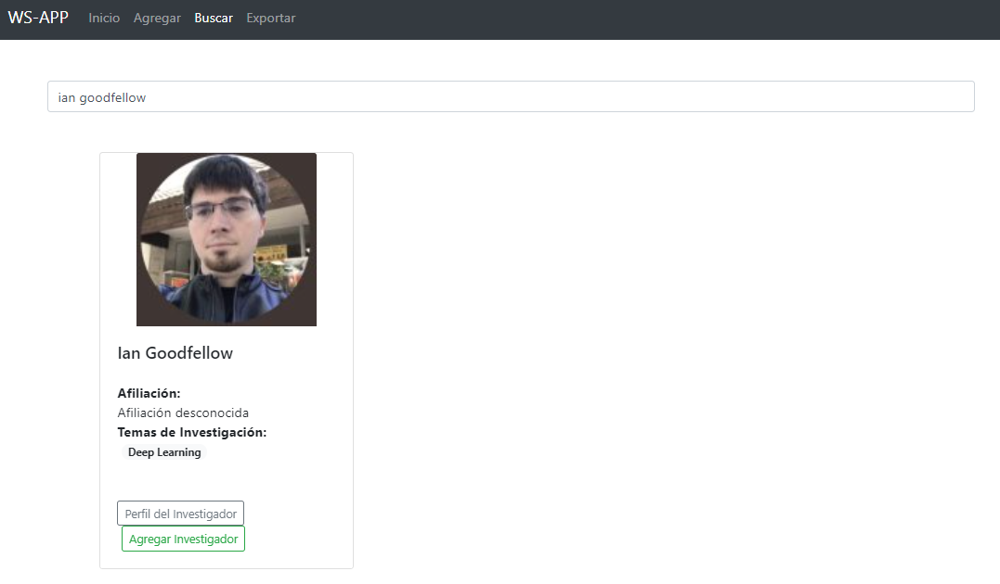
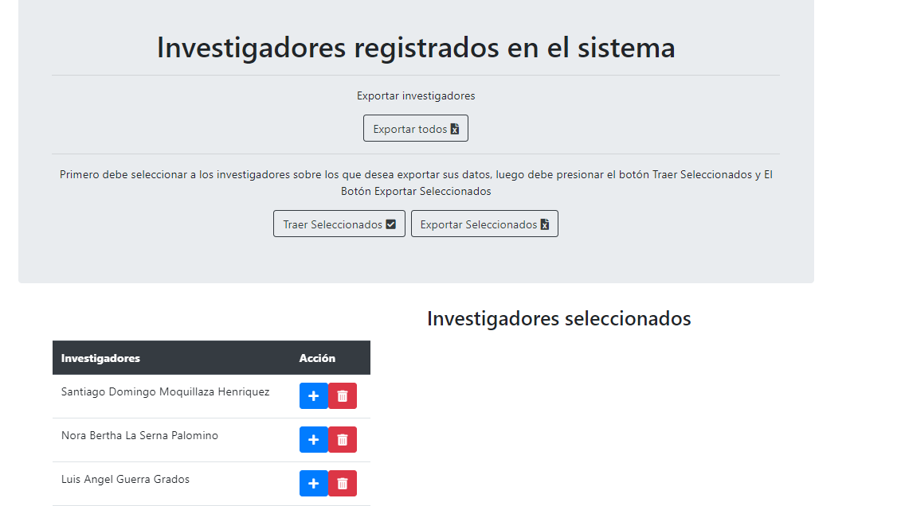

# Proyecto de recolección de datos de investigadores desde google scholar

Este proyecto consiste en obtener datos de investigadores de Google Scholar, y almacenarlos en un base de datos
para que luego se puedan visualizar de una mejor forma en una aplicación web. El backend está compuesto por
2 apis hechas con python y flask, y el frontend fue desarrollado en angular. Los datos se obtuvieron mediante web scraping, aplicando beautifulsoup.

El proyecto está compuesto de la siguiente forma:

| carpeta | función |
| ------ | ------ |
| api | Parte del Backend, se encarga de la recolección de datos y entregar estos datos al frontend |
| api_reportes | Parte del Backend, permite generar ficheros excel con información de los investigadores o de un investigador en particular |
| front | Es una aplicación web que permite visualizar la información obtenida y facilita el acceso a otras funcionalidades|

## Descripción de las funcionalidades

La Pantalla de inicio Mostará los investigadores cuyos datos ya se encuentran en la base de datos, al hacer click sobre cualquiera de estos se podrá ver más información detallada, ya en esta pantalla también tienes la opción de exportar la información del investigador.

La pestaña Agregar permite agregar un investigador mediante la url de su perfil de investigador de google scholar, para usar esta funcionalidad solo tienes que buscar el perfil del investigador que desees y copiar la url, luego pegas esta url en campo y das click en el botón agregar investigador.


La pestaña Buscar permite buscar investigadores por sus nombres y algunas palabras clave como el lugar donde trabaja o estudia, al pulsar enter mostrará las coincidencias y para agregarlos a la base de datos solo tienes que hacer click en agregar investigador, pero si quieres ir al perfil del investigador en google scholar puedes hacer click en Perfil del investigador.



La pestaña Exportar permite exportar la información general de todos los investigadores al hacer click en Exportar todos. También puedes exportar la información general solo de un grupo de investigadores, seleccionando los investigadoresde interés en la tabla del lado izquierdo, luego pulsas en Traer seleccionados y finalmente en Exportar Seleccionados para descargar el fichero excel que contiene la información general de los investigadores seleccionados.

buscar investigadores por sus nombres y algunas palabras clave como el lugar donde trabaja o estudia, al pulsar enter mostrará las coincidencias y para agregarlos a la base de datos solo tienes que hacer click en agregar investigador, pero si quieres ir al perfil del investigador en google scholar puedes hacer click en Perfil del investigador.




## Configuración del entorno

### Instalación de las librerías para el backend

Lo primero es instalar las librerías necesarias para el backend, esto se hace ejecutando el siguiente comando:
```
pip install -r requirements.txt
```

### Creación de la base de datos
Crear el schema bd_ws en el Gestor mysql y ejecutar los comandos sql del archivo script_creacion_bd.sql

### Levantar el Backend
Para levantar las apis primero se debe situar con la consola dentro de las carpetas api y api_reportes para luego ejecutar el siguiente comando:

```
python app.py
```

### Levantar de frontend
Para el frontend es necesario tener angular, entonces se debe situar en la carpeta del proyecto y ejecutar el siguiente comando:

```
npm install
```

Luego de esto se puede levantar el frontend ejecutando el comando:

```
ng serve -o
```